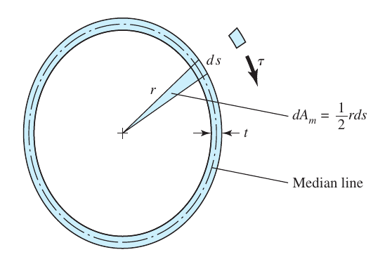
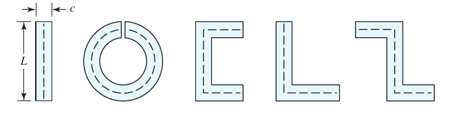
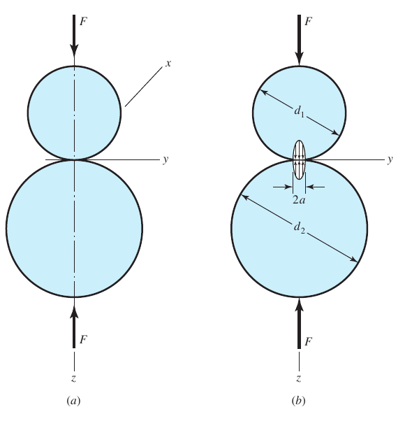
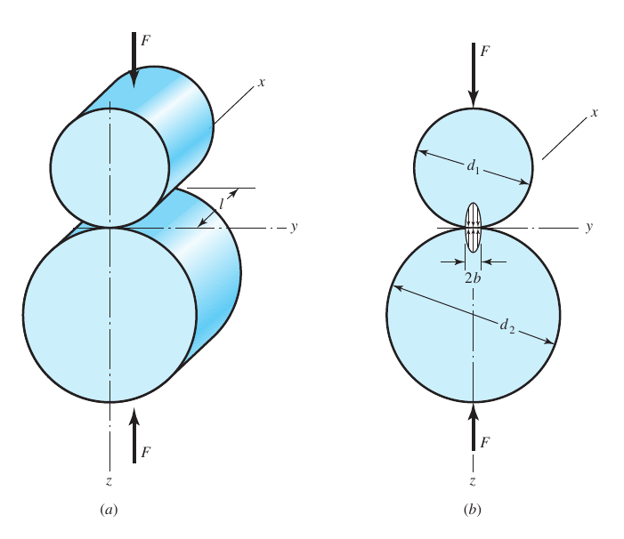

# CH-3

[TOC]

## 3-1 Equilibrium and Free-Body Diagrams

### Equilibrium

$$
\sum{F} = 0\qquad \sum{M}=0
$$

A system with zero acceleration is said to be in **equilibrium**, if that system is motionless or, at most, has constant velocity.

### Free-Body Diagram

Free-body diagrams help simplifying the analysis of a very complex structure or machine by successively isolating each element and then studying and analyzing it.

## 3-2 Shear Force and Bending Moments in Beams

### Definition

$$
\begin{aligned}
V &= \frac{\mathrm{d}M}{\mathrm{d}x}\\[2ex]
\frac{\mathrm{d}V}{\mathrm{d}x}&=\frac{\mathrm{d}^2M}{\mathrm{d}x^2}=q
\end{aligned}
$$

## 3-3 Cartesian Stress Components

### Definition

**Normal stress** is normal to a surface, designated by $\sigma$

**Shear stress** is tangent to a surface, designated by $\tau$

### Plane-Stress Transformation Equations

$$
\begin{aligned}
    \sigma &= \frac{\sigma_x+\sigma_y}{2}+\frac{\sigma_x-\sigma_y}{2}\cos2\phi+\tau_{xy}\sin2\phi\\[2ex]
    \tau &= -\frac{\sigma_x-\sigma_y}{2}\sin2\phi+\tau_{xy}\cos2\phi
\end{aligned}
$$

### Principal Stresses for Plane Stress

$$
\sigma_1, \sigma_2 = \frac{\sigma_x+\sigma_y}{2}\pm\sqrt{(\frac{\sigma_x-\sigma_y}{2})^2+\tau_{xy}^2}
$$

### Principal Directions

$$
\tan2\phi_P = \frac{2\tau_{xy}}{\sigma_x-\sigma_y}
$$

### Maximum Shear Stress

$$
\tau_1,\tau_2 = \pm\sqrt{(\frac{\sigma_x-\sigma_y}{2})^2+\tau_{xy}^2}
$$

### Mohr's Circle Diagram

- center: $\frac{\sigma_x+\sigma_y}{2}$
- radius: $\sqrt{(\frac{\sigma_x-\sigma_y}{2})^2+\tau_{xy}^2}$
- $2\phi_P$: $\frac{2\tau_{xy}}{\sigma_x-\sigma_y}$
- $\phi_S$: $\frac{\pi}{4}-\phi_P$

## 3-4 General Three-Dimensional Stress

where

$$
\tau_{1/2} = \frac{\sigma_1-\sigma_2}{2}\qquad\tau_{2/3}=\frac{\sigma_2-\sigma_3}{2}\qquad\tau_{1/3}=\frac{\sigma_1-\sigma_3}{2}
$$

## 3-5 Elastic Strain

### Hooke's Law

$$
\sigma = E\epsilon
$$

- $E$: Young's modulus, or modulus of elasticity

Tension in one direction produces negative strain in a perpendicular direction

$$
\epsilon_x = \frac{\sigma_x}{E}\qquad \epsilon_y=\epsilon_z = -\mu\frac{\sigma_x}{E}
$$

- $\mu$: the Poisson's ratio

### 3-Dimensional Cases

$$
\begin{aligned}
\epsilon_x &= \frac{1}{E}[\sigma_x-\mu(\sigma_y+\sigma_z)]\\[2ex]
\epsilon_y &= \frac{1}{E}[\sigma_y-\mu(\sigma_x+\sigma_z)]\\[2ex]
\epsilon_z &= \frac{1}{E}[\sigma_z-\mu(\sigma_x+\sigma_y)]\\[2ex]
\end{aligned}
$$

### Hooke's Law for Shear

$$
\tau = G\gamma
$$

- $G$: the shear modules of elasticity

> for a linear, isotropic and homogeneous material **$E = 2G(1+\mu)$**

## 3-6 Stresses

### Uniformly Distributed Stresses

**For tension and compression**

$$
\sigma = \frac{F}{A}
$$

**For direct shear**

$$
\tau = \frac{V}{A}
$$

### Normal Stresses for Beams in Bending

the beam is subjected to pure bending, which means the shear force is zero and that no torsion or axial loads are present

|  |  |
| :-----------------------------: | :-----------------------------: |

the bending stress varies linearly with the distance from the neutral axis

$$
\sigma_x = -\frac{My}{I}
$$

where $I$ is the second-area moment about the z-axis

$$
I = \int{y^2\mathrm{d}A}
$$

and the maximum magnitude of the bending stress will occur where $y$ has the greatest magnitude, where c is the neutral axis

$$
\sigma_{max} = \frac{Mc}{I}
$$

### Two-Plane Bending

cross sections with one or two planes of symmetry only

$$
\sigma_x = -\frac{M_z y}{I_z}+\frac{M_y z}{I_y}
$$

for solid circular cross section, the maximum bending stress is

$$
\sigma_m = \frac{Mc}{I} = \frac{\sqrt{M_y^2+M_z^2}(d/2)}{\pi d^4/64} = \frac{32}{\pi d^3}\sqrt{M_y^2+M_z^2}
$$

### Shear Stresses for Beams in Bending

$$
\tau = \frac{VQ}{Ib}
$$

where $Q$ is the first moment of the area

$$
Q = \int_{y_1}^c{y\mathrm{d}A}
$$

the traverse shear stress in common cross sections 

## 3-6 Torsion

### Round Plane

$$
\theta = \frac{TI}{GJ}
$$

- $T$: torque
- $l$: length
- $G$: modulus of rigidity
- $J$: polar second moment of area

and shear stresses develop throughout the cross section

$$
\tau = \frac{T\rho}{J}\qquad \tau_{max} = \frac{Tr}{J}
$$

where the second polar moment for the solid round section is

$$
J = \frac{\pi d^4}{32}
$$

### Rectangular Section

- shear stress does not vary linearly with radial distance for rectangular cross section
- shear stress is zero at the corners
- maximum shear stress is at the middle of the longest side
- for rectangular $b\times c$ bar, where $b$ is the longest side

$$
\begin{aligned}
    \tau_{max} &= \frac{T}{abc^2} \approx \frac{T}{bc^2}\Big(3+\frac{1.8}{b/c}\Big)\\[2ex]
    \theta &= \frac{Tl}{\beta bc^3 G}
\end{aligned}
$$

### Power, Speed and Torque

Power equals torque times speed

$$
H = T\omega
$$

A convenient conversion with speed in rpm

$$
T = 9.55\frac{H}{n}
$$

## 3-7 Thin-Walled Tubes

for thin-walled tubes, the wall thickness is far less than the tube radius, where shear stress is inversely proportional to wall thickness

### Closed Thin-Walled Tubes

$$
T = \int{\tau t r\mathrm{d}s} = (\tau t)\int{r\mathrm{d}s} = \tau t (2A_m) = 2\tau t A_m
$$

where the **shear stress** equals to

$$
\tau = \frac{T}{2A_m t}
$$

**Angular twist per unit length**

$$
\theta_1 = \frac{TL_m}{4GA_m^2t}
$$

### Open Thin-Walled Tubes

- when the median wall line is not closed, the section is said to be an open section

- some common open thin-walled sections

$$
\tau = G\theta_1 c = \frac{3T}{Lc^2}
$$

## 3-8 Stress Concentration

Since it is quite difficult to design a machine without permitting some changes in the cross sections of the members, a discontinuity in a machine part would alters the stress distribution in the material that the elementary no longer describe the state of stress

A *stress-concentration factor* $K_t$ or $K_{ts}$ is used to relate the actual stress at the discontinuity to the **nominal stress**, which is defined by the following equations

$$
K_t = \frac{\sigma_{max}}{\sigma_0}\qquad K_{ts} = \frac{\tau_{max}}{\tau_0}
$$

## 3-9 Contact Stresses

When two bodies having curved surfaces are pressed together, point or line contact changes to area contact, and the stresses developed in the two bodies are three dimensional.

### Spherical Contact

the radius $a$ of the circular contact ares is given by the equation

$$
a = \sqrt[3]{\frac{3F}{8}\frac{(1-\mu_1^2)/E_1+(1-\mu_2^2)}{1/d_1+1/d_2}}
$$

where the maximum pressure occurs at the center of the contact area and is

$$
p_{max} = \frac{3F}{2\pi a^2}
$$

where the maximum stress is put on the z axis

$$
\sigma_1 = \sigma_2 = \sigma_x = \sigma_y = -p_{max}\Bigg[\Big(1-\Big|\frac{z}{a}\Big|\tan^{-1}\frac{1}{|z/a|}\Big)(1+\nu)-\frac{1}{2\Big(1+\frac{z^2}{a^2}\Big)}\Bigg]
$$

and 

$$
\sigma_3=\sigma_z = -\frac{p_{max}}{1+\frac{z^2}{a^2}}
$$

while for the principle torsion

$$
\tau_{max} = \tau_{1/3} = \tau_{2/3} = \frac{\sigma_1-\sigma_3}{2}= \frac{\sigma_2-\sigma_3}{2}
$$

### Cylindrical Contact

for the cylindrical contacting parts, the equation is similar

$$
b = \sqrt{\frac{2F}{\pi l}\frac{(1-\nu_1^2)/E_1+(1-\nu_2^2)/E_2}{1/d_1+1/d_2}}
$$

then the maximum pressure is

$$
p_{max} = \frac{2F}{\pi bl}
$$

where 

$$
\begin{aligned}
    \sigma_x &= -2\nu p_{max}\Big(\sqrt{1+\frac{z^2}{b^2}}-\Big|\frac{z}{b}\Big|\Big)\\[2ex]
    \sigma_y &= -p_{max}\Bigg(\frac{1+2\frac{z^2}{b^2}}{\sqrt{1+\frac{z^2}{b^2}}}-2\Big|\frac{z}{b}\Big|\Bigg)\\[2ex]
    \sigma_3 &= \sigma_z = -\frac{p_{max}}{\sqrt{1+z^2/b^2}}
\end{aligned}
$$