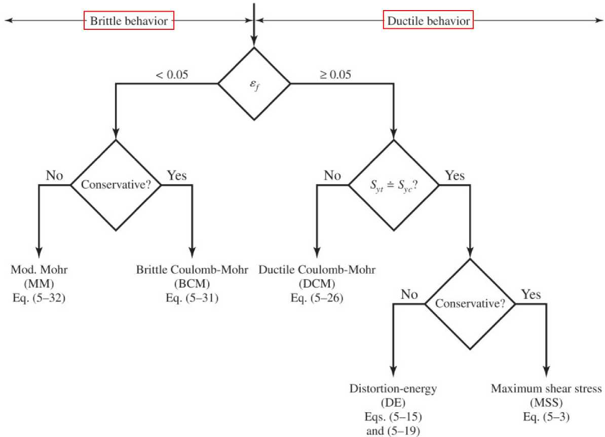

# CH-5

[TOC]

## 5-1 Failure Theories

Unfortunately, there is **no universal theory** of theory of failure for the general case of material properties and stress state.

Instead, several hypotheses have been formulated and tested, leading to today's accepted practices most designers do

## 5-2 Maximum-Shear-Stress Theory for Ductile Materials

### Definition

yielding begins whenever the maximum shear stress in any element equals or exceeds the maximum shear stress in a tension-test specimen of the same material when that specimen begins to yield

### Procedures

- case 1: $\sigma_A\geq\sigma_B\geq 0$
$$
    \sigma_A\geq S_y
$$
- case 2: $\sigma_A\geq 0\geq\sigma_B$
$$
    \sigma_A-\sigma_B\geq S_y
$$
- case 3: $0\geq\sigma_A\geq\sigma_B$
$$
    \sigma_B\leq -S_y
$$

## 5-3 Distortion-Energy Theory for Ductile Materials

### Definition

yielding begins whenever the maximum shear stress in any element equals or exceeds the maximum shear stress in a tension-test specimen of the same material when that specimen begins to yield. 

### Procedures

$$
\sigma_{av} = \frac{\sigma_1+\sigma_2+\sigma_3}{3}
$$

since the strain energy per unit volume for simple tension is $u = \frac{1}{2}[\epsilon_1\sigma_1+\epsilon_2\sigma_2+\epsilon_3\sigma_3]$, which equals to 

$$
u = \frac{1}{2E}[\sigma_1^2+\sigma_2^2+\sigma_3^2-2\nu(\sigma_1\sigma_2+\sigma_2\sigma_3+\sigma_3\sigma_1)]
$$

and the average strain energy could be expressed like

$$
\begin{aligned}
    u_{v} &= \frac{3\sigma_{av}^2}{2E}(1-2\nu)\\[2ex]
          &= \frac{1-2\nu}{6E}(\sigma_1^2+\sigma_2^2+\sigma_3^2+2\sigma_1\sigma_2+2\sigma_2\sigma_3+2\sigma_3\sigma_1)
\end{aligned}
$$

the distortion energy could be obtained by the following equation

$$
u_d = u-u_v = \frac{1+\nu}{6E}((\sigma_1-\sigma_2)^2+(\sigma_2-\sigma_3)^2+(\sigma_3-\sigma_1)^2)
$$

### Deriving the Distortion Energy

