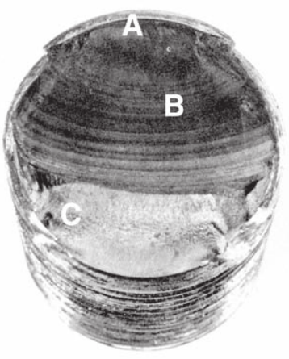

# CH-6

[TOC]

## 6-1 Introduction to Fatigue in Metals

### Definition

Often, the stresses on machine members are repeated, alternating or **fluctuating stresses**. And the machine who found to have failed under fluctuating stresses maybe only compressed **far below** the yield strength. Hence, the failure that undergoes a repeating number of stresses is called as a ***fatigue failure***, which also **gives no warning**.

### Stages of Fatigue Failure

- Initiation of micro-crack due t cyclic plastic deformation
- Progresses to macro-crack that repeatedly opens and closes, creating band called *beach marks*
- Crack has propagated far enough that remaining material is insufficient to carry the load and fails by simple ultimate failure

## 6-2 Fatigue-Life Method

There are three major fatigue life methods and all methods predict life in number of cycles to failure $N$, for a specific level of loading

- Stress-life method
  - least accurate, particularly for low cycle applications
  - most traditional, easiest to implement
- **Strain-life method**
  - Detailed analysis of plastic deformation at localized regions
  - Several idealizations are compounded, leading to uncertainties in results
- Linear-elastic fracture mechanics method
  - Assumes crack exists
  - Predicts crack growth with respect to stress intensity

## 6-3 Strain-life Method

### S-N Diagram

to describe the fatigue strength in the whole cycles, the number of cycles to failure at carrying stress levels is plotted on log scale

- $S_e$: the endurance limit ($N = 10^6$ for steels)
- $N>10^6$: infinite life
- $10^3<N<10^6$: finite life
- $N<10^3$: quasi-static, where yielding often occurs

### Manson-Coffin Relationship between Fatigue Life and Total Strain

|  |  |
| :--------------------------------: | :--------------------------------: |

from the first figure, we can know that

$$
\frac{\Delta\varepsilon}{2}=\frac{\Delta\varepsilon_e}{2}+\frac{\Delta\varepsilon_p}{2}
$$

while according to the next figure

$$
\begin{aligned}
    \frac{\Delta\varepsilon_p}{2} &= \varepsilon'_F(2N)^c\\[2ex]
    \frac{\Delta\varepsilon_e}{2} &= \frac{\sigma'_F}{E}(2N)^b\\[2ex]
\end{aligned}
$$

therefore, we get the equation

$$
\frac{\Delta\varepsilon}{2}=\varepsilon'_F(2N)^c+\frac{\sigma'_F}{E}(2N)^b
$$

### Endurance Limit

the endurance limit for steels has been experimentally found to be related to the ultimate strength

$$
\begin{aligned}
    S'_e =
    \begin{cases}
        0.5S_{ut}\qquad &S_{ut}\leq 200\;\text{kpsi} (1400\;\text{MPa})\\[2ex]
        100\;\text{kpsi}&S_{ut}> 200\;\text{kpsi}\\[2ex]
        700\;\text{MPa}&S_{ut}> 1400\;\text{MPa}
    \end{cases}
\end{aligned}
$$

### Fatigue Strength

#### Low Cycle Fatigue

to approximate the idealized S-N diagram, define the specimen fatigue strength at a specific number of cycles as

$$
(S'_f)_N = \frac{E\Delta\varepsilon_e}{2}
$$

while we have that

$$
\frac{\Delta\varepsilon_e}{2} = \frac{\sigma'_F}{E}(2N)^b
$$

then we get

$$
(S'_f)_N=\sigma'_F(2N)^b
$$

where $\sigma'_F = \sigma_0\varepsilon^m$ with $\varepsilon=\varepsilon'_F$, if the true-stress-true-strain equation is not known, the SAE approximation for steels with $H_b\leq500$ may be used

$$
\sigma'_F = S_{ut} +50\;\text{kpsi}\qquad \sigma'_F = S_{ut} +345\;\text{MPa}
$$

to find b, substitute the endurance strength and corresponding cycles $S'_e$ and $N_e$ into the equation and solving for b

$$
b = -\frac{\log(\sigma'_F/S'_e)}{\log(2N_e)}
$$

#### Actual Mechanical Component

$$
S_f = aN^b
$$

where $N$ is cycles to failure and the constants $a$ and $b$ re defined by the points $10^3$

$$
\begin{aligned}
    a &= \frac{(fS_{ut})^2}{S_e}\\[2ex]
    b &= -\frac{1}{3}\log\Big(\frac{fS_{ut}}{S_e}\Big)\\[2ex]
\end{aligned}
$$

if a completely reversed stress $\sigma_{\text{ref}}$ is given, setting $S_f = \sigma_{\text{ref}}$, and the number of cycles-tp-failure can be expressed as

$$
N = \Big(\frac{\sigma_{\text{ref}}}{a}\Big)^{1/3}
$$

## 6-4 Endurance Limit Modifying Factors

